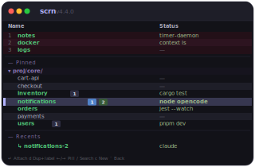

<p align="center">
  
</p>

<h1 align="center">scrn</h1>

<p align="center">A terminal UI for managing GNU Screen sessions.</p>

## Install

```bash
curl -fsSL https://raw.githubusercontent.com/jensbech/scrn/main/install | bash
```

Binaries available for macOS (ARM64/x86_64) and Linux (x86_64/ARM64).

## Setup

Add to your shell config for full session-switching support:

```bash
# zsh (~/.zshrc)
eval "$(scrn init zsh)"

# bash (~/.bashrc)
eval "$(scrn init bash)"
```

```bash
scrn   # launch
```

## Features

- Browse and manage Screen sessions in an interactive table
- Create, rename, and kill sessions
- Seamless session-to-session jumping without nesting
- Search and filter sessions with fuzzy matching
- Embedded PTY display when attached
- Shell integration for zsh and bash

## Keybindings

**Session list:** `j/k` navigate, `Enter` attach, `c` create, `n` rename, `x` kill, `d` go home, `/` search, `r` refresh, `?` legend, `q` quit

**Attached:** `Esc Esc` detach, `Ctrl+A,D` standard Screen detach

## Development

```bash
cargo build    # debug build
just build     # release build
just lint      # format + clippy
```
